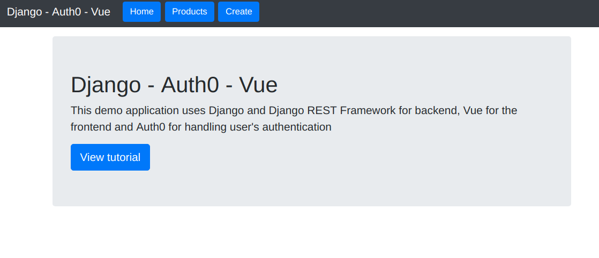
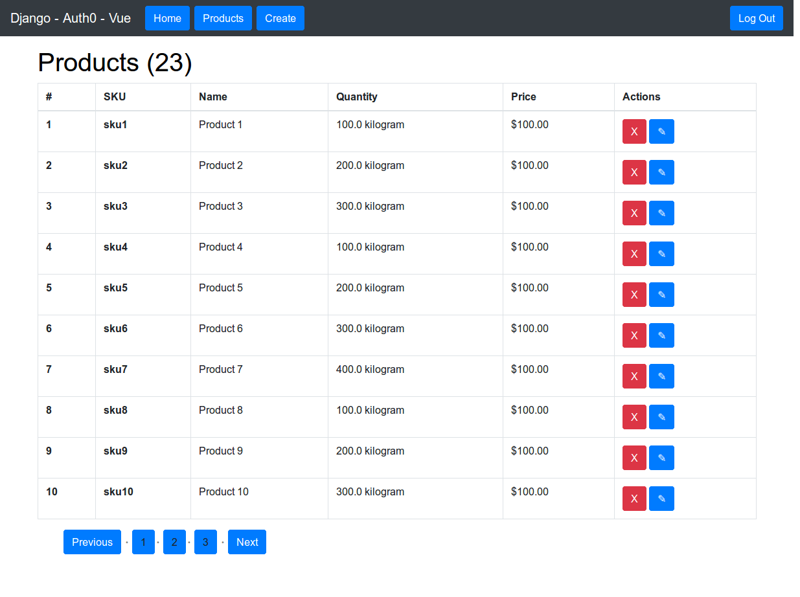
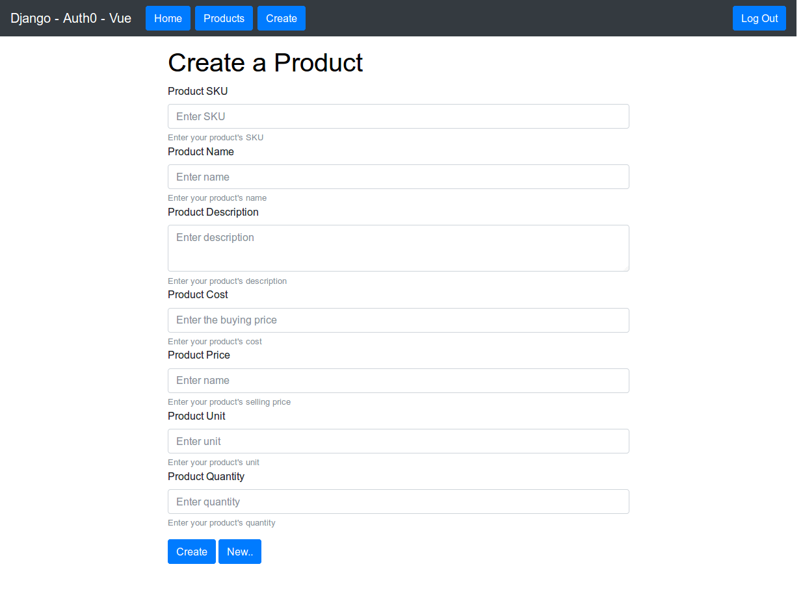
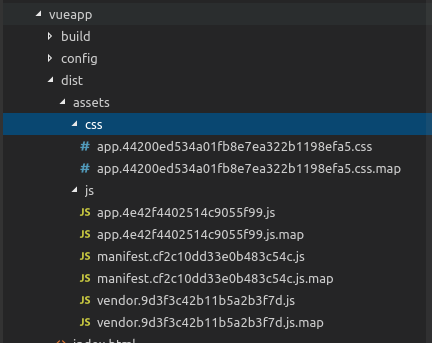
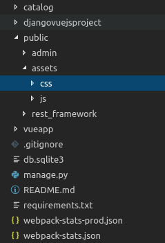

- [Building the REST API](#building-the-rest-api)
  - [Adding the Product Model](#adding-the-product-model)
  - [Adding the Serializer Class](#adding-the-serializer-class)
  - [Adding the API Views](#adding-the-api-views)
  - [Adding the Product List/Create API View](#adding-the-product-listcreate-api-view)
  - [Adding the Product Detail API View](#adding-the-product-detail-api-view)
  - [Adding API Endpoints](#adding-api-endpoints)
- [Creating the Service to Consume the API](#creating-the-service-to-consume-the-api)
  - [Getting Products](#getting-products)
  - [Getting a Product by Id](#getting-a-product-by-id)
  - [Getting Products by URL](#getting-products-by-url)
  - [Deleting a Product](#deleting-a-product)
  - [Creating a Product](#creating-a-product)
  - [Updating a Product](#updating-a-product)
- [Creating the Front End Views](#creating-the-front-end-views)
  - [Building the App View](#building-the-app-view)
  - [Adding Routing mode to The Vue Router](#adding-routing-mode-to-the-vue-router)
  - [Adding the Home View](#adding-the-home-view)
  - [Adding route for the Home View](#adding-route-for-the-home-view)
  - [Adding component Loading](#adding-component-loading)
  - [Adding the Product List View](#adding-the-product-list-view)
  - [Adding route for the Product List View](#adding-route-for-the-product-list-view)
  - [Adding filter currency](#adding-filter-currency)
  - [Fix error: GET /product-list HTTP/1.1" 404](#fix-error-get-product-list-http11-404)
  - [Fix error: No 'Access-Control-Allow-Origin' header is present](#fix-error-no-access-control-allow-origin-header-is-present)
  - [Adding the Product Create/Update View](#adding-the-product-createupdate-view)
  - [Adding route for the Product Create/Update View](#adding-route-for-the-product-createupdate-view)
- [Getting Ready for Production](#getting-ready-for-production)

## Building the REST API

Django REST framework is a powerful and easy to use package for building Web APIs.

Let's get started by building a simple REST API using Django REST framework.

### Adding the Product Model

Django has a powerful ORM (Object Relational Mapper) that allows you to work with multiple database management systems without actually writing any SQL. All you need to do is to define models in Python classes and Django will take care of mapping Python classes to SQL queries.

The API is built around a simple product model so continuing with the project you've built in the previous part open the **catalog/models.py** file then add the following model

```python
from django.db import models

class Product(models.Model):

    sku = models.CharField(max_length=13,help_text="Enter Stock Keeping Unit")    
    name = models.CharField(max_length=200, help_text="Enter product name")
    description = models.TextField(help_text="Enter product description")

    buyPrice = models.DecimalField(decimal_places=2, max_digits=20,help_text="Enter product price per unit")
    sellPrice = models.DecimalField(decimal_places=2, max_digits=20,help_text="Enter product price per unit")

    unit = models.CharField(max_length=10,help_text="Enter product unit")

    quantity = models.DecimalField(decimal_places=1, max_digits=20,help_text="Enter quantity")

    def get_absolute_url(self):
         """
         Returns the url to access a particular instance of Product.
         """
         return reverse('product-detail-view', args=[str(self.id)])

    def __str__(self):

        return self.sku
```

Now you need to migrate your database to add the new changes

```shell
python manage.py makemigrations
python manage.py migrate
```

Next let's add some seed data using a data migration

So first make an empty migration by running the following command:

```shell
python manage.py makemigrations catalog --empty

```

Next open your migration file in your app migrations folder (**catalog/migrations**) then create a function that will executed by the **RunPython()** method when you apply your migration

```python
from django.db import migrations
from django.conf import settings

def create_data(apps, schema_editor):
    Product = apps.get_model('catalog', 'Product')
    Product(sku='sku1',name='Product 1', description='Product 1', buyPrice=100 , sellPrice=100,unit='kilogram', quantity=100).save()
    Product(sku='sku2',name='Product 2', description='Product 2', buyPrice=100 , sellPrice=100,unit='kilogram', quantity=200).save()
    Product(sku='sku3',name='Product 3', description='Product 3', buyPrice=100 , sellPrice=100,unit='kilogram', quantity=300).save()

    Product(sku='sku4',name='Product 4', description='Product 1', buyPrice=100 , sellPrice=100,unit='kilogram', quantity=100).save()
    Product(sku='sku5',name='Product 5', description='Product 2', buyPrice=100 , sellPrice=100,unit='kilogram', quantity=200).save()
    Product(sku='sku6',name='Product 6', description='Product 3', buyPrice=100 , sellPrice=100,unit='kilogram', quantity=300).save()
    Product(sku='sku7',name='Product 7', description='Product 4', buyPrice=100 , sellPrice=100,unit='kilogram', quantity=400).save()

    Product(sku='sku8',name='Product 8', description='Product 1', buyPrice=100 , sellPrice=100,unit='kilogram', quantity=100).save()
    Product(sku='sku9',name='Product 9', description='Product 2', buyPrice=100 , sellPrice=100,unit='kilogram', quantity=200).save()
    Product(sku='sku10',name='Product 10', description='Product 3', buyPrice=100 , sellPrice=100,unit='kilogram', quantity=300).save()
    Product(sku='sku11',name='Product 11', description='Product 4', buyPrice=100 , sellPrice=100,unit='kilogram', quantity=400).save()

    Product(sku='sku12',name='Product 12', description='Product 1', buyPrice=100 , sellPrice=100,unit='kilogram', quantity=100).save()
    Product(sku='sku13',name='Product 13', description='Product 2', buyPrice=100 , sellPrice=100,unit='kilogram', quantity=200).save()
    Product(sku='sku14',name='Product 14', description='Product 3', buyPrice=100 , sellPrice=100,unit='kilogram', quantity=300).save()
    Product(sku='sku15',name='Product 15', description='Product 4', buyPrice=100 , sellPrice=100,unit='kilogram', quantity=400).save()

    Product(sku='sku16',name='Product 16', description='Product 1', buyPrice=100 , sellPrice=100,unit='kilogram', quantity=100).save()
    Product(sku='sku17',name='Product 17', description='Product 2', buyPrice=100 , sellPrice=100,unit='kilogram', quantity=200).save()
    Product(sku='sku18',name='Product 18', description='Product 3', buyPrice=100 , sellPrice=100,unit='kilogram', quantity=300).save()
    Product(sku='sku19',name='Product 19', description='Product 4', buyPrice=100 , sellPrice=100,unit='kilogram', quantity=400).save()

    Product(sku='sku20',name='Product 20', description='Product 1', buyPrice=100 , sellPrice=100,unit='kilogram', quantity=100).save()
    Product(sku='sku21',name='Product 21', description='Product 2', buyPrice=100 , sellPrice=100,unit='kilogram', quantity=200).save()
    Product(sku='sku22',name='Product 22', description='Product 3', buyPrice=100 , sellPrice=100,unit='kilogram', quantity=300).save()
    Product(sku='sku23',name='Product 23', description='Product 4', buyPrice=100 , sellPrice=100,unit='kilogram', quantity=400).save()

class Migration(migrations.Migration):
    dependencies = [
        ('catalog', '0001_initial'),
    ]
    operations = [
        migrations.RunPython(create_data),
    ]
```

You can then migrate your database to create the initial data

```shell
python manage.py migrate
```

### Adding the Serializer Class

From [Django REST framework docs](http://www.django-rest-framework.org/api-guide/serializers/) here is the definition of a serializer

    Serializers allow complex data such as querysets and model instances to be converted to native Python datatypes that can then be easily rendered into JSON, XML or other content types. Serializers also provide deserialization, allowing parsed data to be converted back into complex types, after first validating the incoming data.

Create a `serializers.py` file inside your the catalog app folder then add the following code to create a serializer class for the product model

```python
from rest_framework import serializers
from .models import Product
class ProductSerializer(serializers.ModelSerializer):

    class Meta:
        model = Product 
        fields = ('pk','sku', 'name', 'description', 'buyPrice','sellPrice','unit','quantity')
```

### Adding the API Views

After adding the database model and the serializer class and also some seed data the next thing is to create the API views that will be responsible for creating, updating, deleting and fetching data from the database and send it back to users as JSON database when users request the appropriate API endpoint so go ahead and open the **catalog/views.py** file then start by adding the following imports

```python
from rest_framework import status
from rest_framework.decorators import api_view
from rest_framework.response import Response
from django.core.paginator import Paginator, EmptyPage, PageNotAnInteger
from .models import Product
from .serializers import *
```

This code imports different classes from DRF package, paginator classes to add pagination and then the Product model and its serializer class.

### Adding the Product List/Create API View

In your **catalog/views.py** add the following view function which can process either GET or POST requests to either return paginated list of products or create a product.

```python
@api_view(['GET', 'POST'])
def product_list(request):
    """
    List  products, or create a new product.
    """
    if request.method == 'GET':
        data = []
        nextPage = 1
        previousPage = 1
        products = Product.objects.all()
        page = request.GET.get('page', 1)
        paginator = Paginator(products, 10)
        try:
            data = paginator.page(page)
        except PageNotAnInteger:
            data = paginator.page(1)
        except EmptyPage:
            data = paginator.page(paginator.num_pages)

        serializer = ProductSerializer(data,context={'request': request} ,many=True)
        if data.has_next():
            nextPage = data.next_page_number()
        if data.has_previous():
            previousPage = data.previous_page_number()

        return Response({'data': serializer.data , 'count': paginator.count, 'numpages' : paginator.num_pages, 'nextlink': '/api/products/?page=' + str(nextPage), 'prevlink': '/api/products/?page=' + str(previousPage)})

    elif request.method == 'POST':
        serializer = ProductSerializer(data=request.data)
        if serializer.is_valid():
            serializer.save()
            return Response(serializer.data, status=status.HTTP_201_CREATED)
        return Response(serializer.errors, status=status.HTTP_400_BAD_REQUEST)
```

This function first checks if it's a GET or POST request then preforms the processing based on the type of the request:

- If it's a GET request, the function retrieves the page number from the GET request or use the first page by default if no page is submitted then retrieves the request page of products, serialize it and return it back alongside with other information such as the next page and previous page links.
- If it's a POST request, the function creates the product based on the POST data.

### Adding the Product Detail API View

Now you need to add the view function that will be responsible for getting, updating or deleting a single product by id depending on the type of the HTTP request (GET, PUT or DELETE).

```python
@api_view(['GET', 'PUT', 'DELETE'])
def product_detail(request, pk):
    """
    Retrieve, update or delete a product instance.
    """
    try:
        product = Product.objects.get(pk=pk)
    except Product.DoesNotExist:
        return Response(status=status.HTTP_404_NOT_FOUND)

    if request.method == 'GET':
        serializer = ProductSerializer(product,context={'request': request})
        return Response(serializer.data)

    elif request.method == 'PUT':
        serializer = ProductSerializer(product, data=request.data,context={'request': request})
        if serializer.is_valid():
            serializer.save()
            return Response(serializer.data)
        return Response(serializer.errors, status=status.HTTP_400_BAD_REQUEST)

    elif request.method == 'DELETE':
        product.delete()
        return Response(status=status.HTTP_204_NO_CONTENT)
```

This view method first checks if a product, with the primary key passed as a parameter, exists. If it does exist it returns a 404 response otherwise it checks for the request method:

- If it's a GET the product is simply returned
- If it's a PUT the product is updated
- If it's a DELETE the product is deleted

### Adding API Endpoints

Next you need to create the two API endpoints **api/products/** for querying and creating products **and api/products/<id>** for displaying single product information, updating and deleting single products by their id.

Go ahead and open **backend/urls.py** then add

```python
from django.contrib import admin
from django.urls import path
from django.views.generic import TemplateView
from django.conf.urls import url

from catalog import views

urlpatterns = [
    path('admin/', admin.site.urls),
    url(r'^api/products/$', views.product_list),
    url(r'^api/products/(?P<pk>[0-9]+)$', views.product_detail),
]
```

Re-run django server

```shell
python manage.py runserver
```

## Creating the Service to Consume the API

Now that you have created the API you need to consume it from your app front-end built with Vue. You'll use the Axios HTTP client to make HTTP calls to the API.

For the sake of organizing the code you'll encapsulate all the code that communicates with the API in one single class that will be used from different views to make any calls to the API endpoints.

So inside **frontend/src** create an **http** folder (or call it whatever you want) then create the **APIService.js** class

This class provides wrapper methods for the Axios get, post, put and delete methods.

The APIService.js class contains these methods

- getProducts(): you'll use this method to retrieve paginated list of products
- getProduct(pk): you'll use this method to retrieve a product by id/primary key
- createProduct(product): you'll use this method to create a product
- updateProduct(product): you'll use this method to update a product
- deleteProduct(product): you'll use this method to delete a product

In **APIService.js** copy the following code

```javascript
import axios from 'axios';
const API_URL = 'http://localhost:8000';

export class APIService{
    constructor(){

    }

    /* The other methods go here */
}
```

This code imports axios and AuthService class then declares an API_URL constant pointing to the URL of the local Django server and finally declares and exports the APIService which contains different methods to interact with the Django API.

Let's now see the implementations of different methods of the APIService

### Getting Products

Let's start with the **getProducts()** to query the API endpoint for available products. Copy the following code to your **APIService.js** file:

```javascript
    getProducts() {
        const url = `${API_URL}/api/products/`;
        return axios.get(url).then(response => response.data);
    }
```

The **getProducts()** method sends a GET request to the **/api/products/** endpoint using **axios.get()** method with the Auth0 authorization header retrieved from the local storage.

### Getting a Product by Id

Let's now see the implementation of the getProduct(pk) method for retrieving single products.

```javascript
    getProduct(pk) {
        const url = `${API_URL}/api/products/${pk}`;
        return axios.get(url).then(response => response.data);
    }
```

The **getProduct(pk)** method sends an authorized GET request to **/api/products/<pk>** endpoint for retrieving a single product by its id or primary key.

### Getting Products by URL

The API you created returns links to access the previous and next pages of data so you need to add this method which retrieves the products for a specified page by its URL.

```javascript
    getProductsByURL(link){
        const url = `${API_URL}${link}`;
        return axios.get(url).then(response => response.data);

    }
```

### Deleting a Product

Let's now add the function which handles calling the endpoint for deleting a single product

```javascript
    deleteProduct(product){
        const url = `${API_URL}/api/products/${product.pk}`;
        return axios.delete(url);
    }
```

The **deleteProduct(product)** sends a DELETE request to the **/api/products/<pk>** endpoint using the **axios.delete()** method.

### Creating a Product

Next, let's add the method to create a product

```javascript
    createProduct(product){
        const url = `${API_URL}/api/products/`;
        return axios.post(url,product);
    }
```

The **createProduct(product)** function sends a POST request to the **/api/products/** endpoint with an authorization token retrieved from the local storage using the **axios.post()** method.

### Updating a Product

The last method is used for updating products

```javascript
    updateProduct(product){
        const url = `${API_URL}/api/products/${product.pk}`;
        return axios.put(url,product);
    }
```

The **updateProduct(product)** sends a PUT request to the **/api/products/<pk>** endpoint with an authorization header using the **axios.put()** method.

## Creating the Front End Views

Now it's time to create the front end views to display, create, update and delete products

The demo app you are going to build has the following views:

- **App.vue**: this is the main view which includes the common header of all pages and the router view in which the other components are inserted by the Vue router
- **Home.vue**: this is the home view with some information about the project
- **ProductList.vue**: this page displays a paginated list of products with links to the other pages
- **ProductCreate.vue**: this is the product create view for creating and also updating products
- **Callback.vue**: this is the callback view that will be called when Auth0 authentication is successful to handle the authentication and saves the auth token in the local storage.

### Building the App View

Let's start by adding the **App.vue** template. The generated Vue project already contains an **App.vue** file so simply update it to reflect the following template

```html
<template>
<div>
    <nav class="navbar navbar-expand-md navbar-dark fixed-top bg-dark">
      <a class="navbar-brand" href="#">Django - Auth0 - Vue</a>
      <button class="navbar-toggler" type="button" data-toggle="collapse" data-target="#navbarCollapse" aria-controls="navbarCollapse" aria-expanded="false" aria-label="Toggle navigation">
        <span class="navbar-toggler-icon"></span>
      </button>
      <div class="collapse navbar-collapse" id="navbarCollapse">
        <ul class="navbar-nav mr-auto">

          <li class="nav-item">
          <a class="btn btn-primary" href="/">Home</a>
          </li>
          <li class="nav-item">
          <a class="btn btn-primary" href="/product-list">Products</a>
          </li>
          <li class="nav-item">
          <a class="btn btn-primary" href="/product-create">Create</a>
          </li>

        </ul>
      </div>
    </nav>

    <div class="container">
      <router-view></router-view>
    </div>

</div>  
</template>
```

This code a header styled with Bootstrap that contains links to different pages and button to login and logout then a **<router-view>** component which renders the matched component for the given path. See the docs for [router-view](https://router.vuejs.org/api/).

You don't need to add the JavaScript code for the **App.vue** component, because we don't need handle anything here.

Also make sure to include Bootstrap 4 using the CSS @import

So download [bootstrap 4](https://getbootstrap.com/docs/4.0/getting-started/download/) and unzip it in the **assets** folder then add a <style> block with the following content


```html
<style>
@import './assets/bootstrap.min.css';
body {
  min-height: 75rem;
  padding-top: 4.5rem;
}
.nav-item{
  padding:1px;
  margin-left: 5px;
}
</style>
```

This is a screen shot of the header you should get


### Adding Routing mode to The Vue Router

Open the **src/router/index.js** file then add the mode **history** to router declaration:

```javascript
export default new Router({
  mode: 'history',
  routes: [
      //...
})
```

### Adding the Home View

Next let's add the home view. Navigate inside the components folder then create and open the **Home.vue** file.

First copy the following template:

```html
<template>
    <main role="main">
      <div class="jumbotron">
        <h1>Django - Auth0 - Vue</h1>
        <p class="lead">This demo application uses Django and Django REST Framework for backend, Vue for the frontend and Auth0 for handling user's authentication</p>
        <a class="btn btn-lg btn-primary" href="" role="button">View tutorial</a>
      </div>
    </main>
</template>
```

Aside from that this component displays a Bootstrap jumbotron with some information about the demo.

Next add the following JavaScript code in the same file

```javascript
<script>
  export default {
    name: 'home',
 }
</script>
```

### Adding route for the Home View

Open the **src/router/index.js** file then add

```javascript
//...
import Home from '@/components/Home'
//...
export default new Router({
  mode: 'history',
  routes: [
    //...
    {
      path: '/',
      name: 'Home',
      component: Home
    },
    //...
```

**NOTE** Remove already **HelloWorld** path to change it from / to /**hello-world**

This is what you should get at this point



### Adding component Loading

This component will be used in Product List View

Now let's create the view to display the paginated list of products fetched from the API endpoint. Go ahead and create the **Loading.vue** file inside the **components** folder then open it.

Next copy the following code for the template part:

```html
<template>

  <div class="spinner" v-if="loading">
    
  </div>
</template>

<script>
/* eslint-disable */
  export default {
    name: 'Loading',
    props: ['loading'],
    data () {
        return {}
    }
  }
</script>

<style>
    h1{
        color: black;
    }
  .spinner {
    position: absolute;
    display: flex;
    justify-content: center;
    height: 100vh;
    width: 100vw;
    background-color: white;
    top: 0;
    bottom: 0;
    left: 0;
    right: 0;
  }
</style>
```

Then download and add file [loading.svg](https://raw.githubusercontent.com/PhungXuanAnh/django-vuejs/good/frontend/src/assets/loading.svg) to folder **src/asserts**

### Adding the Product List View

Now let's create the view to display the paginated list of products fetched from the API endpoint. Go ahead and create the **ProductList.vue** file inside the **components** folder then open it.

Next copy the following code for the template part

```html
<template>
<div>
  <h1>Products ({{numberOfProducts}})</h1>
  <Loading :loading="loading"></Loading>
  <table class="table table-bordered table-hover">
    <thead>
      <tr>
        <th>#</th>
        <th>SKU</th>
        <th>Name</th>
        <th>Quantity</th>
        <th>Price</th>
        <th>Actions</th>
      </tr>
    </thead>
    <tbody>
      <tr v-for="product in products" v-bind:key="product.pk" @click="selectProduct(product)">
        <th>{{product.pk}}</th>
        <th>{{product.sku}}</th>
        <td>{{product.name}}</td>
        <td>{{product.quantity}} {{product.unit}}</td>
        <td>{{product.sellPrice | currency}}</td>
        <td>
          <button class="btn btn-danger" @click="deleteProduct(product)"> X</button>
          <a class="btn btn-primary" v-bind:href="'/product-update/' + product.pk"> &#9998; </a>
        </td>
      </tr>
    </tbody>
  </table>

  <div>
  <ul class="list-horizontal">
    <li><button class="btn btn-primary" @click="getPreviousPage()">Previous</button></li>
    <li v-for="page in pages" v-bind:key="page.link">
      <a class="btn btn-primary" @click="getPage(page.link)">{{ page.pageNumber }}</a>
    </li>
    <li><button class="btn btn-primary" @click="getNextPage()">Next</button></li>
  </ul>
  </div>

  <div class="card text-center" v-if="selectedProduct">
    <div class="card-header">
      #{{selectedProduct.pk}} -- {{selectedProduct.sku}}
    </div>
    <div class="card-block">
      <h4 class="card-title">{{selectedProduct.name}}</h4>
      <p class="card-text">
        {{selectedProduct.description}}
      </p>
      <a class="btn btn-primary" v-bind:href="'/product-update/' + selectedProduct.pk"> &#9998; </a>
      <button class="btn btn-danger" @click="deleteProduct(selectedProduct)"> X</button>
    </div>
  </div>
</div>
</template>
```

This template displays the table of products and details about a selected product below the table.

Next you need to define different methods and variables used in this template so in the same file add the following code

```javascript
<script>
/* eslint-disable */
import {APIService} from '../http/APIService';
import Loading from './Loading';
const apiService = new APIService();

export default {
  name: 'ProductList',
  components: {
    Loading
  },
  data() {
    return {
      selectedProduct:null,
      products: [],
      numberOfPages:0,
      pages : [],
      numberOfProducts:0,
      loading: false,
      nextPageURL:'',
      previousPageURL:''
    };
  }, 
  methods: {
    getProducts(){

      this.loading = true;
      apiService.getProducts().then((page) => {
        this.products = page.data;
        console.log(page);
        console.log(page.nextlink);
        this.numberOfProducts = page.count;
        this.numberOfPages = page.numpages;
        this.nextPageURL = page.nextlink;
        this.previousPageURL = page.prevlink;
        if(this.numberOfPages)
        {
          for(var i = 1 ; i <= this.numberOfPages ; i++)
          {
            const link = `/api/products/?page=${i}`;
            this.pages.push({pageNumber: i , link: link})
          }
        }
        this.loading = false;
      });
    },
    getPage(link){
      this.loading = true;  
      apiService.getProductsByURL(link).then((page) => {
        this.products = page.data;
        this.nextPageURL = page.nextlink;
        this.previousPageURL = page.prevlink;
        this.loading = false;
      });
    },
    getNextPage(){
      console.log('next' + this.nextPageURL);
      this.loading = true;  
      apiService.getProductsByURL(this.nextPageURL).then((page) => {
        this.products = page.data;
        this.nextPageURL = page.nextlink;
        this.previousPageURL = page.prevlink;
        this.loading = false;
      });

    },
    getPreviousPage(){
      this.loading = true;  
      apiService.getProductsByURL(this.previousPageURL).then((page) => {
        this.products = page.data;
        this.nextPageURL = page.nextlink;
        this.previousPageURL = page.prevlink;
        this.loading = false;
      });

    },
    deleteProduct(product){
      console.log("deleting product: " + JSON.stringify(product))
      apiService.deleteProduct(product).then((r)=>{
        console.log(r);
        if(r.status === 204)
        {
          /*for(var i = this.products.length-1; i--;){
            console.log(this.products[i].pk);
            if (this.products[i].pk === product.pk) 
            {
              console.log("deleting product " + this.products[i].pk)
              this.products.splice(i, 1);
            }
          }*/
          alert("Product deleted");
          this.$router.go()

        }
      })
    },
    selectProduct(product){
      this.selectedProduct = product;
    }
  },
  mounted() {

    this.getProducts();

  },
}
</script>
```

Next, add css part:

```css
<style scoped>
.list-horizontal li {
    display:inline-block;
}
.list-horizontal li:before {
    content: '\00a0\2022\00a0\00a0';
    color:#999;
    color:rgba(0,0,0,0.5);
    font-size:11px;
}
.list-horizontal li:first-child:before {
    content: '';
}
</style>
```

In nutshell this code creates an instance of the APIService class then wraps different methods to get and delete products and also to get previous and next pages of data.

### Adding route for the Product List View

Open the **src/router/index.js** file then add

```javascript
//...
import ProductList from '@/components/ProductList'
//...
export default new Router({
  mode: 'history',
  routes: [
    //...
    {
        path: '/product-list',
        name: 'ProductList',
        component: ProductList
    },
    //...
```

### Adding filter currency

Open **src/main.js**, add at the end of file

```javascript
Vue.filter('currency', function (value) {
  return '$' + parseFloat(value).toFixed(2)
})
```

### Fix error: GET /product-list HTTP/1.1" 404

At this point, when you click button **Product** you should get error **GET /product-list HTTP/1.1" 404**

To fix, open **backend/urls.py** and change line:

```python
    url(r'^$', TemplateView.as_view(template_name='index.html'), name='index'),
```

to

```python
    url(r'^(?:.*)/?$', TemplateView.as_view(template_name='index.html'), name='catchall'),
```

and the result of **urls.py** is:

```python
from django.contrib import admin
from django.urls import path
from django.views.generic import TemplateView
from django.conf.urls import url

from catalog import views

urlpatterns = [
    path('admin/', admin.site.urls),
    url(r'^api/products/$', views.product_list),
    url(r'^api/products/(?P<pk>[0-9]+)$', views.product_detail),
    url(r'^(?:.*)/?$', TemplateView.as_view(template_name='index.html'), name='catchall'),
]
```

**NOTE:** use extracly sequence of url declared in urls.py as above, if not, you should encountered error **Forbidden (CSRF cookie not set.): /api/products/** when create new product or can't get product in Product view

### Fix error: No 'Access-Control-Allow-Origin' header is present

Click button **Product** again, then press **F12** to open debug console in Chrome, you shoule see error **Failed to load http://localhost:8000/api/products/: No 'Access-Control-Allow-Origin' header is present on the requested resource. Origin 'http://127.0.0.1:8000' is therefore not allowed access.**

To fix, open **`settings.py`** change following code:

```python
CORS_ORIGIN_WHITELIST = (
    'localhost:8080',
    '127.0.0.1:8080',
    'localhost:8000',
    '127.0.0.1:8000',
)
```

This is a screen shot of what you should get



### Adding the Product Create/Update View

This view is used to create and also update products by id so create a **ProductCreate.vue** file then open it and add the following template

```html
<template>

        <div id="container" class="container">

            <div class="row">

                <div class="col-sm-8 offset-sm-2">
                <div class="alert alert-warning" v-show="showCreateMessage"  >
                  <button type="button" class="close" @click="hideMessage()">X</button>
                  <strong>Product successfully created!</strong>
                </div>
                <div class="alert alert-warning" v-show="showUpdateMessage"  >
                  <button type="button" class="close" @click="hideMessage()">X</button>
                  <strong>Product successfully updated!</strong>
                </div>

                <div class="alert alert-warning" v-show="showError"  >
                  <button type="button" class="close" @click="hideMessage()">X</button>
                  <strong>Error!</strong>
                </div>
                    <h1>Create a Product</h1>
                    <div class="info-form">
                      <form>
                        <div class="form-group">
                          <label for="sku">Product SKU</label>
                          <input v-model="product.sku" type="text" class="form-control" id="sku" aria-describedby="skuHelp" placeholder="Enter SKU">
                          <small id="skuHelp" class="form-text text-muted">Enter your product's SKU</small>
                          <label for="name">Product Name</label>
                          <input v-model="product.name" type="text" class="form-control" id="name" aria-describedby="nameHelp" placeholder="Enter name">
                          <small id="nameHelp" class="form-text text-muted">Enter your product's name</small>

                          <label for="description">Product Description</label>
                          <textarea v-model="product.description" class="form-control" id="description" aria-describedby="descHelp" placeholder="Enter description"></textarea>
                          <small id="descHelp" class="form-text text-muted">Enter your product's description</small>

                          <label for="buyPrice">Product Cost</label>
                          <input v-model="product.buyPrice" type="text" class="form-control" id="buyPrice" aria-describedby="buyPriceHelp" placeholder="Enter the buying price">
                          <small id="buyPriceHelp" class="form-text text-muted">Enter your product's cost</small>

                          <label for="sellPrice">Product Price</label>
                          <input v-model="product.sellPrice" type="text" class="form-control" id="sellPrice" aria-describedby="sellPriceHelp" placeholder="Enter name">
                          <small id="sellPriceHelp" class="form-text text-muted">Enter your product's selling price</small>

                          <label for="unit">Product Unit</label>
                          <input v-model="product.unit" type="text" class="form-control" id="unit" aria-describedby="unitHelp" placeholder="Enter unit">
                          <small id="unitHelp" class="form-text text-muted">Enter your product's unit</small>

                          <label for="quantity">Product Quantity</label>
                          <input v-model="product.quantity" type="text" class="form-control" id="quantity" aria-describedby="quantityHelp" placeholder="Enter quantity">
                          <small id="quantityHelp" class="form-text text-muted">Enter your product's quantity</small>

                        </div>
                      </form>
                       <button class="btn btn-primary" v-if="!this.product.pk" @click="createProduct()" ><span v-if="!creating">Create</span><span v-if="creating">Creating... Please wait </span></button>
                       <button class="btn btn-primary" v-if="this.product.pk" @click="updateProduct()" ><span v-if="!updating">Update</span><span v-if="updating">Updating... Please wait </span></button>
                       <button class="btn btn-primary"  @click="newProduct()" >New..</button>

                    </div>
                </div>
            </div>
        </div>

</template>
```

Next you need to add this code in the same file:

```javascript
<script>
import {APIService} from '../http/APIService';

const apiService = new APIService();

export default {
  name: 'ProductCreate',
  components: {
  },
  data() {
    return {
      showCreateMessage: false,
      showUpdateMessage: false,
      showError: false,
      product: {},
      products: '',
      creating: false,
      updating: false
    };
  }, 
  methods: {
    hideMessage(){
      this.showCreateMessage = false;
      this.showUpdateMessage = false;
      this.showError = false;
    },
    createProduct(){
      this.creating = true;
      apiService.createProduct(this.product).then((result)=>{
          if(result.status === 201){
            this.product = result.data;
            this.showCreateMessage = true;
          }
          this.creating = false;          
      },(error)=>{
        this.showError = true;
        this.creating = false;
      });
    },
    updateProduct(){
      this.updating = true;
     apiService.updateProduct(this.product).then((result)=>{
          if(result.status === 200){
            this.showUpdateMessage = true;
          }

      },(error)=>{
        this.showError = true;
        this.updating = false;
      });
    },
    newProduct(){
      this.product = {};
    }

  },
  mounted() {

    if(this.$route.params.pk){
        apiService.getProduct(this.$route.params.pk).then((product)=>{
        this.product = product;
      })
    }
  },
}
</script>
```

Next, add css code:

```css
<style scoped>
.aform{
  margin-left:  auto;
  width: 60%;
}
</style>
```


### Adding route for the Product Create/Update View

Open the **src/router/index.js** file then add

```javascript
//...
import ProductCreate from '@/components/ProductCreate'
//...
export default new Router({
  mode: 'history',
  routes: [
    //...
    {
    path: '/product-create',
    name: 'ProductCreate',
    component: ProductCreate
    },
    {
        path: '/product-update/:pk',
        name: 'ProductUpdate',
        component: ProductCreate
    },
    //...
```

This is a screen shot of what you should get 



## Getting Ready for Production

In the previous part you have seen how you can integrate Django and Vue in development phase where you can have two development servers (Django and Vue). In this section you will learn how integrate Django with Vue in production.

So in **frontend/build/webpack.prod.conf.js** import **webpack-bundle-tracker** as follow:

```javascript
const BundleTracker = require('webpack-bundle-tracker')
```

Then add BundleTracker to plugins

```javascript
plugins: [
    new BundleTracker({filename: '../webpack-stats-prod.json'}),
    //...
```

This tells **BundleTracker** to generate **webpack-stats-prod.json** in the root folder.

In **frontend/config/index.js** change **static** to **assets** (because commonly Django uses the **/static/** URL for serving static files so you don't want to have URLs with **/static/static/** paths). You also need to set the assets public path to **/static/** so Webpack can generate URLs because Django serves static files over the **/static/** URL.

```javascript
  build: {
      // Template for index.html
      index: path.resolve(__dirname, '../dist/index.html'),

      // Paths
      assetsRoot: path.resolve(__dirname, '../dist'),
      assetsSubDirectory: 'assets', 
      assetsPublicPath: '/static/',
```

Run the following command for generating the build files

```shell
npm run build
```

You will get file **webpack-stats-prod.json** and a frontend/dist folder that contains the build files.



Next in **settings.py** change

```python
WEBPACK_LOADER = {
    'DEFAULT': {
        'BUNDLE_DIR_NAME': '',
        # 'STATS_FILE': os.path.join(BASE_DIR, '../webpack-stats.json'),
        'STATS_FILE': os.path.join(BASE_DIR, '../webpack-stats-prod.json'),
    }
}
```

it tell webpack loader use production file generated by above command, then add:

```python
STATICFILES_DIRS = (
    os.path.join(BASE_DIR, '../frontend/dist'),
)

STATIC_ROOT = os.path.join(BASE_DIR, 'public')
```

**STATICFILES_DIRS** contains folders where Django can find static files. These folders will be later copied to where **STATIC_ROOT** points after collecting the static files using the collectstatic command

So go ahead and run this command to collect all static files in the project and put them in the public folder

```shell
python manage.py collectstatic
```

A public folder will be created and all static files will be copied there.



In production Webpack will produce many chunks of your bundle for performance reasons so you'll need to change your Django template to include all the chunks

Open **catalog/templates/index.html** then update the template like the following

```html


<html  lang="en">
<head>
<meta  charset="UTF-8">
<title>Django - Auth0 - Vue</title>


</head>
<body>
<div  id=app>
</div>




</body>
</html>
```

Run django server again

```shell
python manage.py runserver
```

You can try if that works for you using the Django server without the need to deploy to a production server using command `npm start` or `npm run dev`. One difference from the development setup is that you don't need to run the Vue dev server since you have the built files of your front-end app served by Django.